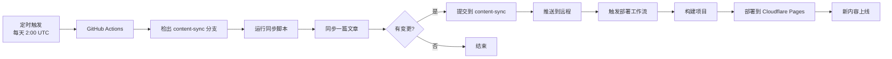
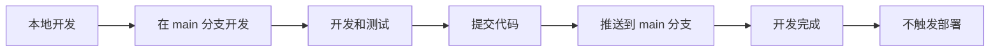

# 🌿 分支策略说明

## 📋 分支概览

本项目采用**双分支策略**，将开发工作与生产环境内容分离：

| 分支 | 用途 | 更新方式 | 部署 |
|------|------|---------|------|
| `main` | 开发主分支 | 手动开发和提交 | ❌ 不部署 |
| `content-sync` | 生产环境内容分支 | GitHub Actions 自动同步 | ✅ 自动部署到 Cloudflare Pages |

## 🎯 分支详解

### 1. `main` 分支（开发主分支）

**用途**：
- ✅ 代码开发和功能迭代
- ✅ 测试新功能
- ✅ 不部署到生产环境

**更新方式**：
- 直接推送开发代码
- 功能开发和 bug 修复
- 代码审查和测试

**特点**：
- 用于日常开发工作
- 可以自由提交和推送
- 不会触发生产部署

### 2. `content-sync` 分支（生产环境内容分支）

**用途**：
- ✅ 生产环境内容
- ✅ 自动化文章同步
- ✅ 自动部署到 Cloudflare Pages

**更新方式**：
- GitHub Actions 每天自动运行
- 自动同步一篇新文章
- 自动提交、推送并部署

**工作流程**：
```
articles/ (源文件)
    ↓
GitHub Actions 运行
    ↓
同步到 app/articles/
    ↓
自动提交到 content-sync 分支
    ↓
自动触发部署到 Cloudflare Pages
    ↓
新内容上线
```

## 🔄 工作流程

### 自动化同步和部署流程



### 手动开发流程



## 📝 使用指南

### 初始化分支

```bash
# 1. 创建 content-sync 分支
git checkout -b content-sync

# 2. 推送到远程
git push -u origin content-sync

# 3. 返回 main 分支
git checkout main
```

### 自动化同步和部署（GitHub Actions）

自动化任务会：
1. 每天凌晨 2:00 UTC（北京时间 10:00）自动运行
2. 在 `content-sync` 分支上同步一篇新文章
3. 自动提交和推送到 `content-sync` 分支
4. 自动触发部署到 Cloudflare Pages
5. 新内容自动上线

### 手动触发同步

```bash
# 在 GitHub Actions 页面手动触发
# 或使用 GitHub CLI
gh workflow run "Sync Articles to App Directory"
```

### 合并内容到主分支

**方式 1：通过 GitHub Web 界面**
1. 访问 GitHub 仓库
2. 点击 "Pull requests"
3. 点击 "New pull request"
4. 选择 `content-sync` → `main`
5. 审核变更
6. 点击 "Merge pull request"

**方式 2：通过命令行**
```bash
# 1. 切换到 main 分支
git checkout main

# 2. 合并 content-sync 分支
git merge content-sync

# 3. 推送到远程
git push origin main
```

**方式 3：通过 GitHub CLI**
```bash
# 创建 PR
gh pr create --base main --head content-sync --title "Sync articles from content-sync" --body "Auto-generated PR from content sync"

# 合并 PR
gh pr merge <PR-number> --merge
```

## 🔧 配置 GitHub Actions

### 修改工作流配置

工作流已配置为在 `content-sync` 分支上工作：

```yaml
on:
  schedule:
    - cron: '0 2 * * *'  # 每天 2:00 AM UTC
  workflow_dispatch:
  push:
    branches:
      - content-sync  # 只在 content-sync 分支触发
    paths:
      - 'articles/**'
```

### 自动创建 PR（可选）

如果希望自动创建 PR，可以在工作流中添加：

```yaml
- name: Create Pull Request
  if: steps.check_changes.outputs.has_changes == 'true'
  uses: peter-evans/create-pull-request@v5
  with:
    token: ${{ secrets.GITHUB_TOKEN }}
    branch: content-sync
    base: main
    title: '🔄 Auto-sync: New article added'
    body: |
      ## 📖 自动同步文章
      
      此 PR 由 GitHub Actions 自动创建。
      
      ### 变更内容
      - 同步了新的文章到 `app/articles/`
      - 更新了相关的 `_meta.ts` 文件
      
      ### 检查清单
      - [ ] 文章内容正确
      - [ ] Meta 文件格式正确
      - [ ] 测试通过
      
      **同步时间**: ${{ github.event.head_commit.timestamp }}
```

## 🛡️ 分支保护规则（建议）

### main 分支保护

在 GitHub 仓库设置中配置：

1. **Settings** → **Branches** → **Add rule**
2. **Branch name pattern**: `main`
3. 启用以下规则：
   - ✅ Require a pull request before merging
   - ✅ Require approvals (1)
   - ✅ Require status checks to pass before merging
   - ✅ Require branches to be up to date before merging
   - ✅ Include administrators

### content-sync 分支配置

- ✅ 允许 GitHub Actions 直接推送
- ✅ 不需要 PR 审核
- ✅ 自动化工作流专用

## 📊 监控和维护

### 检查同步状态

```bash
# 查看分支差异
git diff main..content-sync

# 查看 content-sync 分支的提交历史
git log content-sync --oneline -10

# 查看待合并的提交
git log main..content-sync --oneline
```

### 定期合并

建议每周或每月定期将 `content-sync` 合并到 `main`：

```bash
# 1. 更新本地分支
git fetch origin

# 2. 切换到 main 分支
git checkout main
git pull origin main

# 3. 合并 content-sync
git merge origin/content-sync

# 4. 解决冲突（如果有）
# 编辑冲突文件...
git add .
git commit

# 5. 推送到远程
git push origin main
```

## 🚨 故障排除

### 问题 1: 合并冲突

**解决方案**:
```bash
# 1. 切换到 main 分支
git checkout main

# 2. 尝试合并
git merge content-sync

# 3. 如果有冲突，手动解决
# 编辑冲突文件...

# 4. 标记为已解决
git add .
git commit -m "Resolve merge conflicts"

# 5. 推送
git push origin main
```

### 问题 2: GitHub Actions 推送失败

**可能原因**:
- 分支保护规则阻止了推送
- GITHUB_TOKEN 权限不足

**解决方案**:
1. 检查分支保护规则
2. 确保 `content-sync` 分支允许 GitHub Actions 推送
3. 在工作流中使用正确的 token

### 问题 3: 分支落后太多

**解决方案**:
```bash
# 将 main 的更新合并到 content-sync
git checkout content-sync
git merge main
git push origin content-sync
```

## 📈 最佳实践

1. **定期合并** - 每周或每月将 `content-sync` 合并到 `main`
2. **审核内容** - 合并前检查新增的文章内容
3. **运行测试** - 合并前确保所有测试通过
4. **保持同步** - 定期将 `main` 的更新合并回 `content-sync`
5. **监控日志** - 定期检查 GitHub Actions 运行日志

## 🔗 相关文档

- [文章同步指南](./ARTICLE_SYNC_GUIDE.md)
- [测试指南](./TESTING_GUIDE.md)
- [部署指南](./CLOUDFLARE_DEPLOYMENT.md)
- [快速开始](./QUICK_START.md)

---

**最后更新**: 2025-11-06  
**维护者**: Easy Bible Team

